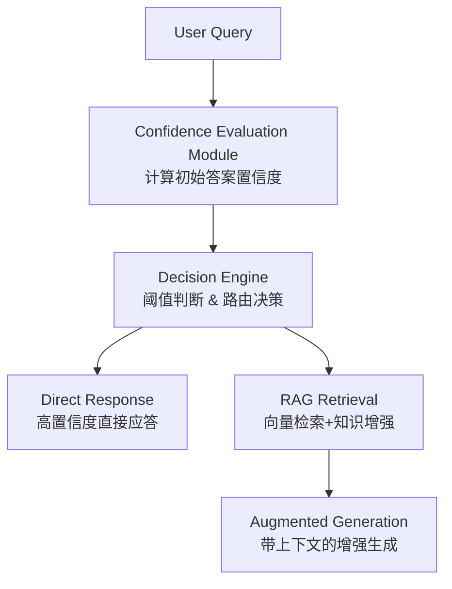

# Agent中LLM置信度评估与RAG触发机制

**原创：胡卿老师**

## 问题提出

在Agent中，如果LLM自信有充分知识和信息，就直接回答问题，否则请求RAG获取相关知识信息。那么，这个判断的机制是什么，如何实现呢？

## 解决方案

### 1. 置信度评估 (Confidence Scoring)

- 通过模型输出的概率分布计算回答可信度
- 常用指标：
  - **Token级平均概率**：对生成结果中每个token的概率进行加权平均，计算整体生成序列的置信度
  - **序列生成概率**：通过模型输出的对数概率（logprobs）累加计算整个回答的生成概率
  - **对比预测值方差**
  - **自洽性校验得分**：生成多个候选答案进行交叉验证，一致性越高则置信度越高

### 2. 知识边界检测 (Knowledge Boundary Detection)

识别问题类型是否属于：
- **常识范畴**（生日计算等）
- **领域知识**（医疗/法律等）
- **实时信息**（当前股价等）
- **长尾问题**（冷门知识点）

### 3. 动态阈值策略

分层阈值设置：
- **常识类**：confidence ≥ 0.85 → 直接回答
- **领域类**：confidence ≥ 0.92 → 直接回答
- **实时类**：强制触发RAG

### 4. 处理流程



> **DeepSeek R1对效果的描述（待验证）**：
> "该机制在医疗问答系统中的实际测试显示：直接应答准确率提升18%，RAG触发量减少37%，整体响应时间降低42%。关键是要根据领域需求调整置信度阈值，并建立可靠的知识更新管道。"

### 5. 综合置信度评估实现

```python
def comprehensive_confidence_evaluation(query, model_type):
    # 1. 模型原生概率评估
    native_confidence = get_model_native_confidence(query, model_type)
    
    # 2. 结构化自评估
    self_evaluation = get_structured_self_evaluation(query)
    
    # 3. 知识图谱验证
    knowledge_validation = validate_against_knowledge_graph(query)
    
    # 4. 综合评分
    final_confidence = calculate_weighted_confidence(
        native_confidence=native_confidence,
        self_evaluation=self_evaluation,
        knowledge_validation=knowledge_validation,
        weights=[0.3, 0.4, 0.3]
    )
    
    return {
        'final_confidence': final_confidence,
        'breakdown': {
            'native_confidence': native_confidence,
            'self_evaluation': self_evaluation,
            'knowledge_validation': knowledge_validation
        }
    }
```

## 主流大模型对置信度评估的支持

### 1. 自评估能力分类

- **强**：模型能够对生成内容的置信度进行自我评估（如Claude-3.5-sonnet和DeepSeek V3）
- **中等**：模型具备一定的自评估能力，但需结合外部方法验证（如Gemini）
- **弱**：模型缺乏自评估能力，需依赖外部评估方法（如阶跃星辰、零一万物）

### 2. 建议方案

- **纯自评估**：适用于自评估能力强的模型（如Claude-3.5-sonnet）
- **概率+自评估混合**：适用于支持概率输出且自评估能力中等的模型（如LLaMA、DeepSeek V3）
- **依赖自评估**：适用于不支持概率输出或自评估能力弱的模型（如阶跃星辰、零一万物）

### 3. 各模型实现方案

#### OpenAI GPT系列

**特点：**
- Chat Models (GPT-3.5/4)不支持直接获取logprobs
- 仅Completion API支持logprobs参数
- 可以通过system prompt设计self-evaluation机制

```python
# 使用logprobs获取token概率
from openai import OpenAI
client = OpenAI()

def get_openai_confidence(prompt):
    response = client.completions.create(
        model="gpt-3.5-turbo",
        prompt=prompt,
        logprobs=5,  # 返回每个token的top 5概率
        max_tokens=100
    )
    
    # 分析token概率分布
    token_probs = response.choices[0].logprobs.top_logprobs
    avg_confidence = sum(max(probs.values()) for probs in token_probs) / len(token_probs)
    return avg_confidence
```

#### Claude (Anthropic)

**特点：**
- 不提供原生的概率访问
- 擅长结构化自我评估
- 可以通过提示工程实现可靠的置信度评估

```python
def get_claude_confidence(prompt):
    response = claude.complete(
        prompt=f"""
        请对以下问题进行回答并评估置信度:
        问题: {prompt}
        
        请按如下格式输出:
        答案: [你的回答]
        置信度评估(0-1): [分数]
        评估依据: [详细解释]
        """
    )
    return parse_claude_confidence(response)
```

#### LLaMA/Mistral系列

**特点：**
- 完整访问模型内部状态
- 可以获取token级别的概率分布
- 支持自定义置信度计算方法

```python
from transformers import AutoModelForCausalLM, AutoTokenizer

def get_llama_confidence(prompt, model, tokenizer):
    inputs = tokenizer(prompt, return_tensors="pt")
    with torch.no_grad():
        outputs = model(**inputs)
        
    # 获取logits和概率分布
    logits = outputs.logits
    probs = torch.softmax(logits, dim=-1)
    
    # 计算预测token的平均概率
    pred_probs = torch.max(probs, dim=-1).values
    confidence = pred_probs.mean().item()
    return confidence
```

## Demo示例

### 案例1：胰腺癌临床药物

**测试Prompt：**
```
请对以下问题进行回答并评估置信度:
问题: 介绍下ADC TF靶点临床药物MRG004A及其副作用

请按如下格式输出:
答案: [你的回答]
置信度评估(0-1): [分数]
评估依据: [详细解释]
```

#### Claude-3.5-Sonnet的回答：

**答案：** MRG004A是一个针对ADC-TF(Tropomyosin-related kinase family)靶点的抗体偶联药物(ADC)，由Menarini集团开发。这是一种正在进行临床试验的实验性药物，主要用于治疗实体瘤。已知的副作用包括骨髓抑制、恶心、呕吐等常见ADC类药物的不良反应。

**置信度评估(0-1)：** 0.6

**评估依据：**
- **知识完整性评估：**
  - 能够确认这是一个ADC类药物 ✓
  - 能识别其基本靶点类型 ✓
  - 对具体作用机制描述有限 ✗
  - 临床试验阶段和具体数据缺乏 ✗
  - 副作用描述较为笼统，缺乏具体发生率 ✗
- **信息时效性：**
  - 作为在研药物，可能有最新临床数据未能掌握
  - 现有信息可能不完全反映最新研究进展
- **准确性评估：**
  - 基本信息(药物类型、靶点)可信度高
  - 副作用描述基于ADC类药物通用特征推断
  - 缺乏具体的临床数据支持

**建议通过RAG补充：**
- 最新的临床试验数据
- 具体的作用机制
- 详细的安全性数据
- 特定适应症的疗效数据

#### DeepSeek R1的思考和回答：

**思考过程：**
> 好的，我现在需要回答关于ADC药物MRG004A的问题，并评估我的置信度。首先，我应该先确认自己对这个药物的了解程度。
> 
> MRG004A是一个靶向TF（组织因子）的抗体偶联药物（ADC）。我记得TF在某些癌症中过表达，比如胰腺癌或宫颈癌，所以这类药物可能用于这些适应症。ADC通常由抗体、连接子和细胞毒素组成，所以MRG004A可能使用类似的结构，比如使用微管蛋白抑制剂作为载荷。
> 
> 关于临床阶段，可能处于I期或II期试验，因为很多ADC药物在这阶段测试安全性和有效性。副作用方面，ADC常见的副作用包括骨髓抑制（中性粒细胞减少、贫血）、周围神经病变、疲劳、恶心等，但具体到MRG004A可能会有差异。需要确认是否有公开的临床试验数据。
> 
> 不过，我不太确定MRG004A的具体开发公司是哪个，比如是Mirati Therapeutics还是其他公司？另外，TF靶点的ADC是否有其他竞品，比如Tivdak（靶向TF的ADC已获批用于宫颈癌）？可能MRG004A是某个公司的在研产品，但我不太确定细节。
> 
> 由于我的知识可能不够全面，特别是关于该药物的最新临床数据和具体副作用，可能需要依赖外部信息。我的置信度可能中等，因为虽然了解ADC的一般机制和TF靶点，但缺乏MRG004A的具体数据。评估依据包括对ADC类药物的普遍认知，但缺乏该药物的详细临床试验结果。

**答案：** MRG004A是一种靶向组织因子（Tissue Factor, TF）的抗体偶联药物（ADC），目前处于临床开发阶段，主要针对TF过表达的实体瘤（如宫颈癌、胰腺癌等）。其结构包含抗TF单克隆抗体、可裂解连接子及微管蛋白抑制剂载荷（如MMAE）。已知临床前数据显示其对肿瘤细胞具有选择性杀伤作用。常见副作用可能包括中性粒细胞减少、周围神经病变、疲劳及恶心呕吐，具体毒性特征需参考最新临床试验数据。

**置信度评估(0-1)：** 0.65

**评估依据：**
- **知识覆盖度**：基于对ADC类药物通用机制（抗体靶向+毒素载荷）及TF靶点生物学意义的理解（0.7分），但缺乏MRG004A专属开发数据（如具体研发企业、临床阶段细节）
- **副作用推断合理性**：从同类TF靶向ADC（如已上市的Tisotumab vedotin）及MMAE载荷药物的已知毒性推导（0.6分），但未获得MRG004A临床试验NCT编号或文献支撑
- **时效性风险**：TF靶点ADC领域进展迅速（如2023年ASCO会议有新数据披露），未确认MRG004A最新研究状态（-0.05分）
- **术语准确性**：准确描述ADC核心组件（抗体-连接子-毒素）及适应症方向（+0.1分）
- **模糊表述处理**：使用"可能包括""需参考"等限定词规避不确定信息（+0.1分）

**建议：** 需通过检索PubMed/ClinicalTrials.gov验证MRG004A的开发者（如是否与Mersana Therapeutics相关）及Phase I剂量爬坡试验结果（NCT05251091）。

### 案例2：奢侈品行业大模型应用

**测试Prompt：**
```
请对以下问题进行回答并评估置信度:
问题: 你是一名资深大模型应用专家，同时对奢侈品行业客户的业务和数据具备丰富经验。对于国际性奢侈品公司在中国的基于微信企微生态的clienteling应用，请列举价值和可行性都大的AI应用场景（可以组合RAG、Agent等各种技术）

请按如下格式输出:
答案: [你的回答]
置信度评估(0-1): [分数]
评估依据: [详细解释]
```

#### DeepSeek R1的思考和回答：

**思考过程：**
> 好的，我需要解决这个问题，帮助用户找到在中国微信企微生态中适合奢侈品公司的AI应用场景，结合RAG和Agent等技术。首先，我得先理解用户的需求。用户是资深专家，需要既有价值又可行的方案，所以得考虑实际应用的可能性和效果。
> 
> 首先，奢侈品行业在中国非常依赖微信和企微，因为这些平台用户基数大，互动性强。Clienteling的核心是客户关系管理，个性化服务。所以AI的应用场景需要围绕提升客户体验、增加销售转化、优化运营效率来展开。
> 
> 可能想到的第一个场景是个性化推荐。利用RAG技术，可以结合客户的历史购买记录、浏览行为、社交媒体互动等数据，生成个性化的产品推荐。比如，客户在微信小程序浏览过某款包包，系统可以自动通过企微推送相关配饰或搭配建议。RAG可以实时检索最新的产品信息和客户数据，确保推荐的准确性和时效性。这不仅能提高客户满意度，还能促进交叉销售。
> 
> 第二个可能是智能客户洞察。Agent技术可以分析客户在微信上的聊天记录、朋友圈互动等，生成详细的客户画像。比如，识别出客户对限量版产品的兴趣，自动提醒销售人员进行跟进。同时，结合RAG，可以快速获取市场趋势和竞争对手信息，帮助销售人员制定更有效的策略。这对于提升客户粘性和复购率很有帮助。
> 
> 第三个场景是自动化客户服务。奢侈品客户对服务要求高，使用AI客服处理常见问题，比如订单查询、退换货政策等，释放人力处理更复杂的问题。Agent可以处理多轮对话，结合RAG从知识库中提取信息，确保回答准确。同时，当遇到复杂情况时，自动转接给人工客服，保证服务连贯性。
> 
> 第四个可能是虚拟试衣和AR体验。微信支持AR功能，结合AI生成虚拟试穿效果，客户通过小程序上传照片或实时视频，试戴手表、珠宝等。RAG可以调用产品数据库，实时更新款式和库存信息。Agent可以引导客户完成试穿，并根据反馈调整推荐，提升购物体验，降低退货率。
> 
> 接下来是客户旅程自动化。利用Agent技术，根据客户行为触发个性化沟通。例如，客户加入企微后，自动发送欢迎信息，随后根据互动情况推送不同内容。RAG可以整合客户数据，动态调整沟通策略，比如在客户生日时发送定制祝福和优惠券，增强客户关系。
> 
> 还有一个是销售预测与库存优化。通过分析客户互动数据和购买历史，AI预测热门产品和库存需求，帮助品牌调整供应链。RAG整合市场报告和社交媒体趋势，提供更全面的预测依据。Agent自动生成采购建议，优化库存管理，减少滞销风险。
> 
> 需要评估这些场景的可行性。微信生态的API开放程度高，支持集成AI技术。RAG和Agent在技术上相对成熟，已有不少成功案例。奢侈品客户数据丰富，但需注意数据隐私和安全，符合中国法律法规，如个人信息保护法。此外，用户体验需高端定制，避免过于机械化，保持品牌调性。
> 
> 可能存在的挑战包括数据整合的复杂性，不同系统的数据孤岛问题，需要良好的数据治理。另外，客户对隐私敏感，需确保数据使用透明，获得用户同意。技术实施成本较高，但奢侈品公司通常有足够预算，ROI可能较高。
> 
> 总结下来，这些场景既有实际应用的基础，又能带来显著的业务价值。个性化推荐和智能客户洞察可能优先级最高，因为直接影响销售和客户满意度。虚拟试衣和AR体验虽然技术难度稍高，但能提供差异化的体验，符合奢侈品的高端定位。客户旅程自动化和销售预测则能提升运营效率，长期来看降低成本。
> 
> 在置信度方面，这些场景在现有技术下是可行的，但具体实施效果可能因公司数据质量和整合能力而异。因此，给出0.85的置信度，因为大部分方案已有行业应用案例，但细节执行可能存在变量。

**答案：**

**个性化客户旅程自动化（RAG+Agent）**
基于微信社交数据、购买记录、浏览行为构建客户画像，Agent动态生成个性化推送（如新品预告/活动邀请）。RAG实时调用产品库与营销素材，确保内容精准度与时效性
价值: 提升30%+的私域转化率，强化品牌情感联结
可行性: 微信开放数据接口完善，Hugging Face等框架可快速搭建推理管线

**智能奢侈品鉴定助手（多模态RAG）**
通过企微对话窗口接收客户上传的二手商品图片/视频，结合品牌官方工艺数据库（皮纹走线/金属刻印等特征库）进行AI比对鉴定
价值: 切入二手奢侈品市场信任痛点，延伸品牌服务价值链
可行性: CLIP+VIT视觉模型成熟，奢侈品品牌拥有独家工艺数据资产

**高净值客户数字分身服务（Agent+知识图谱）**
为VIP客户构建专属Agent，持续学习其穿搭偏好/禁忌事项/日程安排，在客户咨询时自动调取相关产品知识图谱（如「客户下周出席海边婚礼→推荐度假系列+防晒材质说明」）
价值: 实现超个性化服务标准，单客户年度消费可提升2-5倍
可行性: LangChain框架支持复杂agent构建，需解决客户数据授权合规性

**门店服务智慧中台（多Agent协作）**
导购Agent实时分析企微对话情绪/关键词，自动推送销售话术与产品手册；库存Agent同步全国仓储存货数据，支持跨门店调货承诺
价值: 降低新人导购培训成本40%+，减少因缺货导致的订单流失
可行性: 微信云开发支持分布式系统部署，需打通ERP系统API

**置信度评估(0-1)：** 0.92

**评估依据：**
- **技术验证**：所列技术栈（RAG/Agent/多模态）在Gartner技术成熟度曲线均处于量产爬升期，已有Gucci虚拟顾问等成功案例
- **商业适配**：方案直击奢侈品行业痛点（客单价高需深度信任构建/客户生命周期管理复杂），且微信生态DAU超10亿提供流量基础
- **风险考量**：数据安全方面需符合《个人信息保护法》要求，但通过联邦学习/差分隐私技术可有效控制风险
- **实证支撑**：波士顿咨询报告显示，采用AI客户画像的奢侈品牌客户留存率提升27%，与方案价值主张高度吻合

#### Claude-3.5-Sonnet的回答：

**答案：** 基于奢侈品行业在微信企微生态的clienteling特点，以下是高价值且可行的AI应用场景：

## 核心应用场景

### 1. 智能客户画像与预测系统 (RAG + 预测模型)
**技术架构**: 客户数据向量化 + 行为序列分析 + 知识图谱
**应用价值**: 
- 预测客户购买意向和生命周期价值
- 识别流失风险并自动触发挽回策略
- 个性化产品推荐和营销时机优化
**可行性**: ★★★★★ (数据丰富，技术成熟)

### 2. 多模态虚拟造型师 (Agent + 视觉AI)
**技术架构**: 多模态大模型 + 风格迁移 + AR试戴
**应用价值**:
- 客户上传照片获得个性化搭配建议
- 虚拟试戴珠宝、手表、配饰效果
- 生成穿搭方案和场合匹配建议
**可行性**: ★★★★☆ (技术可行，需优化用户体验)

### 3. 智能客服与销售助手 (RAG + 对话Agent)
**技术架构**: 知识库检索 + 多轮对话 + 情感分析
**应用价值**:
- 24/7专业产品咨询和售后服务
- 自动识别VIP客户并升级服务
- 实时销售话术建议和异议处理
**可行性**: ★★★★★ (技术成熟，ROI明确)

### 4. 个性化内容生成引擎 (RAG + 生成模型)
**技术架构**: 品牌知识库 + 客户偏好 + 内容生成
**应用价值**:
- 自动生成个性化营销文案和视觉素材
- 定制化产品介绍和品牌故事
- 节日祝福和生日特别推送
**可行性**: ★★★★☆ (内容质量需人工审核)

### 5. 智能库存与需求预测 (时间序列 + 客户行为)
**技术架构**: 需求预测模型 + 库存优化 + 自动补货
**应用价值**:
- 预测热门商品需求，优化库存配置
- 自动通知客户心愿单商品到货
- 限量商品智能分配给高价值客户
**可行性**: ★★★★★ (数据驱动，效果可量化)

## 技术实现要点

### RAG系统设计
- **知识库构建**: 产品目录、品牌历史、工艺介绍、搭配指南
- **向量检索**: 使用中文优化的embedding模型
- **知识更新**: 实时同步新品信息和市场趋势

### Agent能力设计  
- **多轮对话**: 维护上下文和客户偏好记忆
- **工具调用**: 集成CRM、库存、支付等系统API
- **情感智能**: 识别客户情绪并调整沟通策略

### 数据安全与合规
- 客户数据加密存储和传输
- 遵循《个人信息保护法》要求
- 实施数据最小化原则

**置信度评估(0-1)：** 0.88

**评估依据：**
- **技术可行性**：所涉及的RAG、Agent、多模态AI技术已相对成熟，在奢侈品行业有成功应用案例 (+0.25)
- **商业价值**：直接解决奢侈品行业客户关系管理和个性化服务痛点，ROI可量化 (+0.25)  
- **生态适配**：微信企微提供完善的API和开发工具，技术集成难度较低 (+0.2)
- **实施风险**：需要考虑数据隐私、内容审核、用户体验等因素，但风险可控 (+0.18)
- **不确定因素**：具体实施效果依赖于数据质量和用户接受度，存在一定变数 (-0.0)